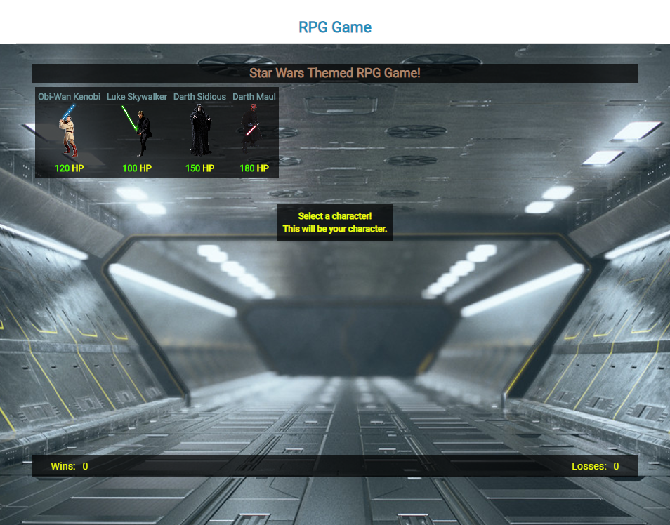
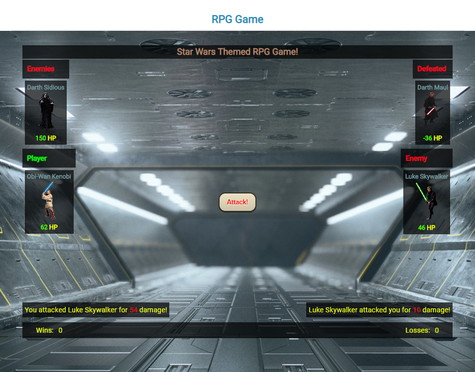

# RPG Game

This is a Star Wars themed RPG game utilizing jQuery.

## Game Logic

* When the game starts, the player will choose a character by clicking on an avatar. The player will fight as that character for the rest of the game.
* The player must then defeat all of the remaining characters.
* The player chooses each opponent by clicking on their avatar.
* Once the player selects an opponent, they are able to click the attack button to fight that opponent.
* Each time the player attacks, their character's Attack Power increases by its base Attack Power.
* Enemy characters only have Counter Attack Power which dos not change.
* Each character is able to defeat all other characters by choosing the right enemy each round.

## Technologies

* HTML
* CSS
* JQuery

## Demo
The Web App is hosted on GitHub Pages. Link: [https://abalomenos.github.io/rpg_game/](https://abalomenos.github.io/rpg_game/).

Updated version hosted at the following link: [http://www.argirisbalomenos.com/portfolio/rpg.html](http://www.argirisbalomenos.com/portfolio/rpg.html)

## Demo

## Demo
